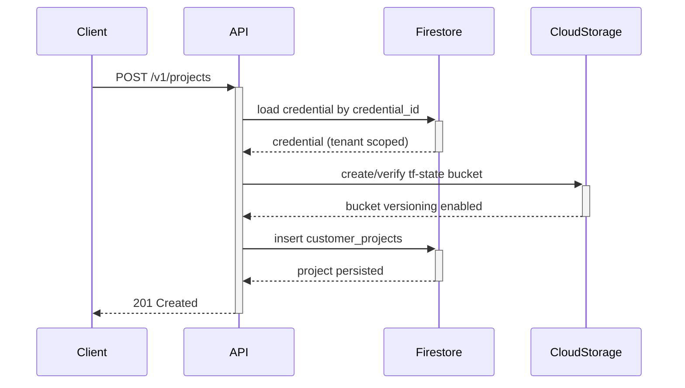
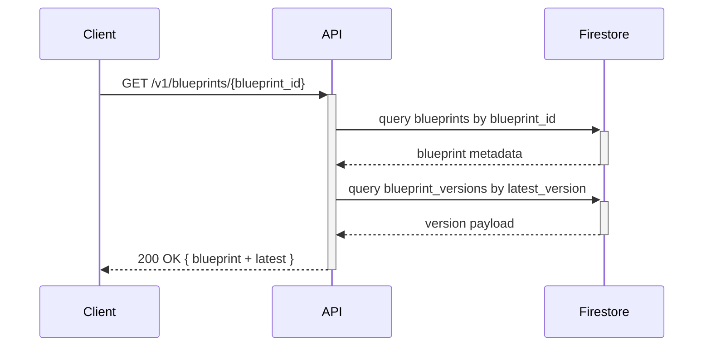
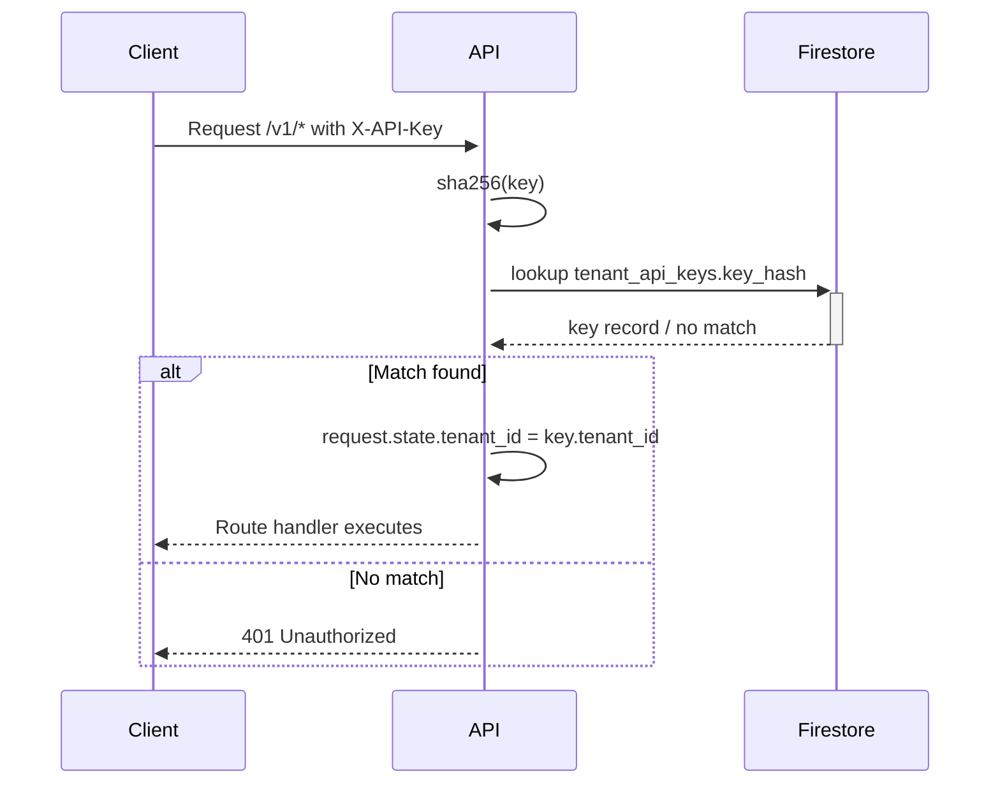

# Internal Architecture

## API Surface (v1)

| Method | Path | Auth | Service | Audit |
|---|---|---|---|---|
| POST | /v1/tenants | Public (bootstrap) | `TenantService.create_tenant` | N/A |
| POST | /v1/tenants/{tenant_id}/api-keys | Public (bootstrap) | `TenantService.create_api_key` | N/A |
| POST | /v1/credentials | API key | `CredentialService.create_credential` | `credential.uploaded` |
| POST | /v1/projects | API key | `ProjectService.link_project` | `project.linked` |
| GET | /v1/blueprints | API key | `BlueprintService.list_blueprints` | N/A |
| GET | /v1/blueprints/{blueprint_id} | API key | `BlueprintService.get_blueprint_with_latest` | N/A |

## Middleware Stack

1. `RequestBodySizeLimitMiddleware`
2. `CORSMiddleware`
3. `SecurityHeadersMiddleware`
4. `FetchMetadataCsrfMiddleware`
5. `APIKeyAuthMiddleware`

`APIKeyAuthMiddleware` enforces API-key auth for tenant-scoped `/v1/*` routes, excluding bootstrap tenant routes.

## Credential + Project Flow

## Blueprint Read Flow

## Auth Data Flow

