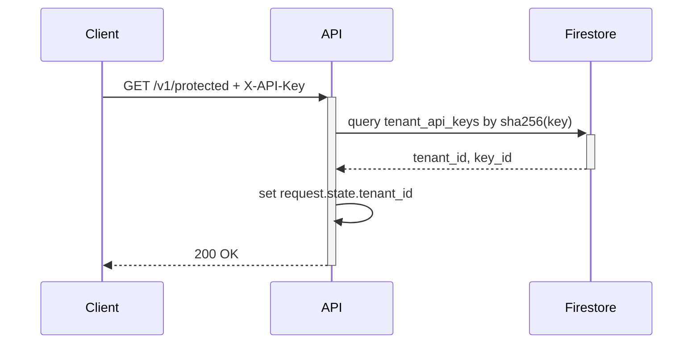
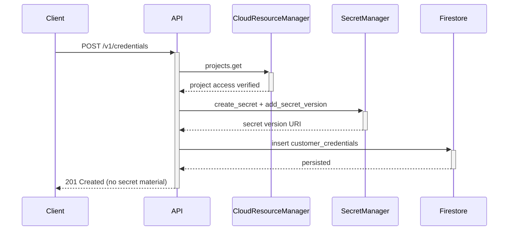

# Progress Log

## 2026-04-25

### API Changes

| Area | Change | Notes |
|---|---|---|
| Auth | Added `X-API-Key` middleware for `/v1/*` routes | Resolves `tenant_id` from hashed keys in Firestore (`tenant_api_keys`) |
| Tenants | Added `POST /v1/tenants` | Creates tenant with plan and timestamp |
| API Keys | Added `POST /v1/tenants/{tenant_id}/api-keys` | Returns plaintext API key once; stores only SHA-256 hash |

### Request Flow (Tenant API key authentication)

### Validation

- Added unit tests for tenant service create + API key hashing.
- Added integration tests for auth middleware allow/deny behavior.

### API Changes (Credential + Project)

| Area | Change | Notes |
|---|---|---|
| Credentials | Added `POST /v1/credentials` | Validates SA key fields, verifies project access, stores secret in Secret Manager, persists `CustomerCredential` |
| Projects | Added `POST /v1/projects` | Validates credential ownership, ensures customer state bucket with versioning, persists `CustomerProject` |

### Request Flow (Credential upload)

### API Changes (Blueprint Catalog)

| Area | Change | Notes |
|---|---|---|
| Blueprints | Added `GET /v1/blueprints` | Returns global blueprint list including latest version payload |
| Blueprints | Added `GET /v1/blueprints/{blueprint_id}` | Returns blueprint metadata and latest version detail |

### Validation

- Added unit tests for blueprint catalog service list/detail logic.
- Added integration tests for authenticated blueprint list/detail endpoints.
